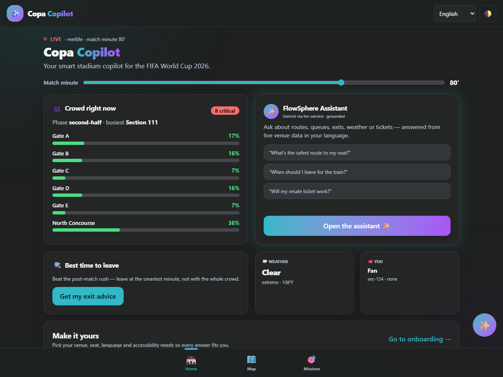
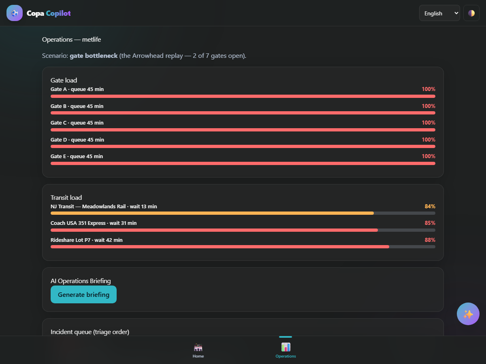
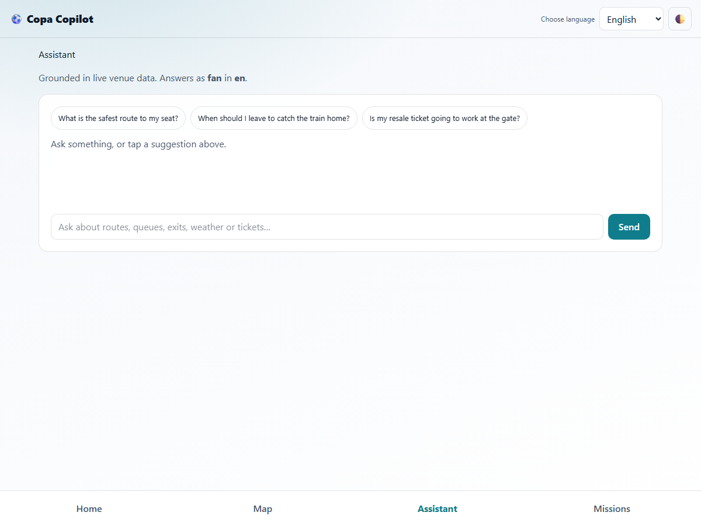

# Copa Copilot — GenAI Smart-Stadium Copilot for FIFA World Cup 2026

> **Version 0.1.0** — a GenAI operations & fan copilot spanning all 16 World Cup 2026 venues, grounded in a deterministic stadium engine and built for the Hack2skill × Google PromptWars "Smart Stadiums & Tournament Operations" challenge.

Copa Copilot gives every stakeholder in a World Cup stadium — fans, organizers, volunteers and venue staff — a conversational copilot that understands live crowd, transit, weather and accessibility conditions, and gives the operations room the same intelligence, summarised. Every answer is backed by an engine you can reproduce in a unit test, and the whole app runs with **zero API keys** in demo mode.



> **Live demo (Cloud Run, us-central1):**
> **Web** → https://copa-copilot-web-767171449038.us-central1.run.app
> **API** → https://copa-copilot-api-767171449038.us-central1.run.app/api/meta

## 30-second verification for evaluators

```bash
# Version + service identity (matches this README, package.json and the git tag)
curl https://copa-copilot-api-767171449038.us-central1.run.app/api/meta
# → {"service":"copa-copilot-api","version":"0.1.0","uptimeSeconds":<n>}

# Live crowd simulation for the MetLife final, post-match egress surge
curl "https://copa-copilot-api-767171449038.us-central1.run.app/api/crowd/metlife?scenario=egress-surge&minute=130"
# → {"snapshot":{...,"zones":[{"zoneId":"gate-a",...,"status":"critical"}...]}}

# Google-services evidence (env-var NAMES only — never values)
curl https://copa-copilot-api-767171449038.us-central1.run.app/api/google/services
# → {"scorecard":{"totalServices":15,"implemented":6,...,"exposesSecretValues":false}}
```

## The problem

The June–July 2026 tournament exposed operational gaps that are documented, not hypothetical:

- **Egress collapse.** Three hours after Brazil vs. Morocco at MetLife, fans were still stranded because transit couldn't move the crowd; NJ Transit's normal $12.90 fare was surged to $150.
- **Ingress failure.** At Arrowhead (Argentina–Algeria), only 2 of 7 complex gates opened — hours of backup, fans abandoning cars to walk over a mile to kickoff.
- **Weather chaos.** Lightning suspended France–Iraq (Philadelphia) 2+ hours under FIFA's 8-mile rule; a heat dome pushed RealFeel to 100–110°F across open-air venues (only 5 of 16 are roofed).
- **Ticket-trust breakdown.** "Ghost tickets" from third-party resale left fans denied entry at the gate after paying; the official app fragments ticketing into a second app with login loops.
- **Sustainability blind spot.** An independent estimate put the tournament's footprint at ~7.8 Mt CO₂e — fans see none of it operationally.

**The pivot:** every incumbent tool (the FIFA app, Lenovo digital twins, crowd-analytics platforms) is either a static wallet-plus-map or a control-room dashboard. **None gives individual stakeholders a context-aware, multilingual, GenAI copilot.** Copa Copilot is that reasoning layer.

## The solution

| Feature | What it does | Google service |
|---|---|---|
| **FlowSphere assistant** | Function-calling copilot: routes, queues, exits, weather, tickets — grounded in live engine data, 6 languages | Gemini (via llm-service) |
| **Crowd-aware routing** | Safest-route engine (not shortest) with wheelchair / low-vision / sensory profiles | (core engine) + Maps JS/Routes (ready) |
| **Exit-wave advisor** | The anti-MetLife feature: when to leave & which gate, with transit-load forecast | (core engine) |
| **Gate-balancing & ops briefing** | Organizer dashboard + one-click AI Operations Briefing with top-3 actions | Gemini API + Cloud Run |
| **Weather-protocol engine** | 8-mile lightning rule + heat tiers → per-persona actions | (core engine) |
| **Entry-readiness checklist** | Anti-ghost-ticket guidance (no real ticket APIs — guidance only) | (core engine) |
| **Operational gamification** | Missions (Beat the Rush, Green Footprint, Smart Exit) with engine-computed points + leaderboards | Firestore (planned) |
| **Evidence page** | `/google-services` renders the live service catalog for judges | Cloud Run |

Covers all eight challenge dimensions (navigation, crowd management, accessibility, transportation, sustainability, multilingual assistance, operational intelligence, real-time decision support) and all four personas.

## ✨ Highlights

| Rubric axis | Evidence |
|---|---|
| **Code Quality** | TypeScript strict everywhere (`noUncheckedIndexedAccess`), zero `any` / `console.log` / `TODO` / `eslint-disable`, ESLint flat config over every workspace, `Result<T,AppError>` channel, one shared zod schema source. See [EVALUATION_MAPPING.md](EVALUATION_MAPPING.md). |
| **Testing** | **~1,470 tests** (1,300 core unit + 119 API integration + 31 web component) at **99.4% core statement coverage**, plus **52 Playwright e2e + axe** runs. Coverage gated in CI. See [TESTING.md](TESTING.md). |
| **Security** | AI routed only through the llm-service proxy (never a direct provider call); zod `.strict()` validation, token-bucket rate limits, prompt-injection nonce boundary, PII-safe structured logs, Secret Manager key by reference, no CSP-with-`unsafe-inline`. See [SECURITY.md](SECURITY.md). |
| **Accessibility** | axe-clean on **all 10 routes in light AND dark**, WCAG 2.1 AA, ARIA meters, keyboard-complete, RTL Arabic, theme-aware contrast. See [ACCESSIBILITY.md](ACCESSIBILITY.md). |
| **Efficiency** | Zero-runtime-dep core, deterministic fallbacks (no retries), briefing cache, reply budgets, scale-to-zero Cloud Run. See [ARCHITECTURE.md](ARCHITECTURE.md). |
| **Google Services** | 15 catalogued (6 implemented, 5 ready-with-key, 4 planned) via evidence-as-code. See [GOOGLE_SERVICES.md](GOOGLE_SERVICES.md). |

## Tech stack

TypeScript · npm-workspaces monorepo · **`@copa/core`** pure domain engine (zod-only) · **Express 4** API on **Cloud Run** · **Next.js 15 + React 19** web on Cloud Run · framer-motion · **Gemini (gemini-3-flash) via the llm-service proxy** · Vitest · Playwright + axe-core · ESLint + Prettier · Docker + Cloud Build + Artifact Registry + Secret Manager + Cloud Logging.

## Quick start (zero keys)

```bash
npm ci
npm run build -w @copa/core                       # core must build once
npm run dev -w @copa/api                           # API on :8080 (DEMO_MODE=true)
npm run dev -w @copa/web                            # web on :3000 → points at the API
```

The entire app works with no API keys: `DEMO_MODE` produces deterministic assistant and briefing replies computed by the same `@copa/core` engines, so the demo is reproducible and the e2e suite asserts real numbers.

## Docker quick start

```bash
docker build -f apps/api/Dockerfile -t copa-api .
docker run -p 8080:8080 -e DEMO_MODE=true copa-api
```

## 🧹 Code quality

- **TypeScript strict** across all workspaces; `noUncheckedIndexedAccess: true`; aligned `target`/`lib` ES2022.
- **ESLint flat config** (`typescript-eslint`) over core, api, web, e2e and scripts; house rules as errors: `no-explicit-any`, `no-non-null-assertion`, `no-console`, `consistent-type-imports`.
- **Test files are type-checked too** (`tsconfig.test.json` per package).
- **Grep-clean**: `scripts/grep-census.ps1` asserts zero `any` / `console.log` / `TODO|FIXME` / `eslint-disable` / `@ts-` in source.
- **`Result<T, AppError>`** error channel — core never throws across boundaries; one safe API envelope.
- **One shared zod schema source** validates both API requests and web responses — drift is a parse error, not a silent bug.

## Screenshots

| Fan dashboard (dark) | Operations (dark) | Assistant (light) |
|---|---|---|
|  |  |  |

## 🏗️ Architecture at a glance

```
Browser (Next.js/React, Cloud Run)
   │  fetch + zod-validated responses
   ▼
Express API (Cloud Run)  ── Gemini API (assistant / briefing, DEMO fallback)
   │  buildApp(config), zod validate, token-bucket, structured logs
   ▼
@copa/core  ── pure deterministic engine (zod only): venues, crowd, routing,
               egress, weather, incidents, entry, sustainability, gamification,
               leaderboard, i18n, google catalog. No Date.now(), no Math.random().
```

## 🗂️ Monorepo file index

```
copa-copilot/
├── packages/core/src/          # deterministic domain engine (17 modules, 1,300 tests)
│   ├── crowd.ts                 #   seeded crowd/queue/transit simulation
│   ├── routing.ts               #   crowd- & accessibility-aware safest route
│   ├── egress.ts                #   exit-wave advisor (anti-MetLife)
│   ├── weather.ts               #   8-mile lightning + heat-tier protocol engine
│   ├── entry.ts                 #   entry-readiness / anti-ghost-ticket
│   ├── gamification.ts          #   missions + THE point-math source
│   ├── schemas.ts               #   one zod source for api + web
│   ├── result.ts / errors.ts    #   Result<T,AppError> + safe taxonomy
│   └── google/service-catalog.ts#   evidence-as-code Google catalog
├── apps/api/src/                # Express on Cloud Run (119 tests)
│   ├── server.ts                #   buildApp(config) factory (supertest-able)
│   ├── routes/                  #   crowd, guidance, incidents, assistant, engagement, meta
│   ├── services/                #   assistant (tools), briefing (cache), gemini-client, store
│   └── middleware/              #   validate, rate-limit, logger (PII-safe)
├── apps/web/                    # Next.js App Router (11 routes, 31 component tests)
│   ├── app/                     #   dashboard, onboarding, map, assistant, ops, volunteer, …
│   ├── components/              #   UI kit + Chrome (skip link, nav, theme, i18n)
│   └── lib/                     #   api-client (zod-validated), session, contracts, strings
├── e2e/                         # Playwright a11y (axe light+dark) + persona journeys (52)
├── cloudbuild-{api,web}.yaml, scripts/deploy.ps1, .github/workflows/ci.yml
└── docs wall: EVALUATION_MAPPING · GOOGLE_SERVICES · SECURITY · TESTING · ACCESSIBILITY · ARCHITECTURE · PROMPTS · CHANGELOG
```

## 🔌 Google services

Full contract in [GOOGLE_SERVICES.md](GOOGLE_SERVICES.md); rendered live at `/google-services` and `GET /api/google/services`. **Implemented:** Gemini API, Cloud Run, Cloud Build, Artifact Registry, Cloud Logging, Secret Manager. **Ready-with-key:** Maps JS, Routes, Cloud Translation, Cloud Text-to-Speech, Google Analytics 4. **Planned:** Firebase Auth, Firestore, BigQuery, Pub/Sub.

## Repository hygiene

The tracked tree contains only source, tests, configuration, rubric-evidence docs and a small set of optimized screenshots — no `node_modules`, build output, coverage, secrets or large binaries (see `.gitignore`). Private working notes live in the git-ignored `docs/` folder. The whole demo runs within Google Cloud free-tier limits.

## 🧭 For evaluators

Start with [EVALUATION_MAPPING.md](EVALUATION_MAPPING.md) — it maps every rubric axis to the exact files, tests and docs that satisfy it. The API contract is in [openapi.yaml](openapi.yaml); repo hygiene is stated in [SUBMISSION_ARTIFACTS.md](SUBMISSION_ARTIFACTS.md). Then open the live web URL, tap **"Get my exit advice"** on the dashboard and ask the assistant *"wheelchair route to my seat"* — both answers quote live engine numbers (the reply is real Gemini via llm-service, `engine: "gemini"`).
